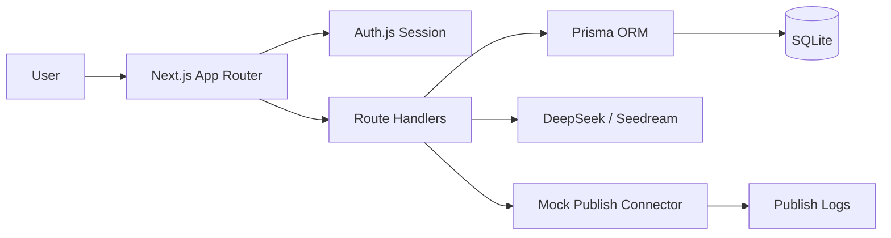

# PostFlow 创流

**AI 驱动的社媒图文创作与一键分发工作台。**

PostFlow 面向独立创作者、品牌社媒运营和小型 MCN，提供从「选题 → AI 写稿 → AI 配图 → 多平台适配 → 预览确认 → 即时/定时发布 → 发布日志」的一体化工作流。项目当前处于全栈 MVP 阶段，已完成可注册、可登录、可持久化、可演示的本地闭环。

---

## 1. 项目概览

| 项目 | 内容 |
|------|------|
| 中文名 | 创流 |
| 英文名 | PostFlow |
| 产品定位 | 社媒图文领域的 AI 创作与发布工作台 |
| 目标用户 | 独立自媒体、品牌社媒运营、小型 MCN / 代运营 |
| 核心价值 | 将图文内容生产与多平台发布从 2–4 小时压缩到 20–40 分钟 |
| 当前阶段 | 全栈 MVP |
| 当前技术路线 | Next.js 单仓全栈 + Auth.js + Prisma + SQLite |
| North Star | 周成功发布篇数（Weekly Published Posts） |

### 一句话介绍

PostFlow 是面向社媒图文创作者的 AI 内容助手，帮助用户在一个工作台完成写稿、配图、平台适配、排期发布和发布记录管理。

### Elevator Pitch

创作者每天需要在 ChatGPT、Canva、小红书后台、微信公众号后台和各种排期工具之间来回切换。PostFlow 将这些分散动作产品化为一个连贯流程：输入选题后生成图文初稿，自动适配小红书和公众号风格，生成对应封面，完成合规检查，并创建即时或定时发布任务。MVP 阶段优先验证「AI 创作 + 多平台发布闭环」是否能显著节省时间并带来持续使用。

---

## 2. 产品功能

### 2.1 用户端能力

| 模块 | 功能 | 当前状态 |
|------|------|----------|
| 用户与鉴权 | 邮箱注册、登录、会话保护、用户数据隔离 | 已完成 |
| 工作台 | AI 额度、待发布草稿、定时队列、最近发布、账号告警 | 已完成 |
| 新建创作 | 输入选题、选择平台、AI 生成初稿、创建空白草稿 | 已完成 |
| 草稿编辑 | 标题、正文、标签编辑，重写、缩短、扩写、换标题 | 已完成 |
| AI 配图 | 小红书 3:4 封面、公众号 2.35:1 封面、上传替换 | 已完成 |
| 平台适配 | 将 master draft 适配为小红书/公众号独立版本 | 已完成 |
| 发布预览 | 小红书卡片预览、公众号文章预览 | 已完成 |
| 合规检查 | 敏感词、广告法风险、平台规则提示 | 已完成 |
| 发布任务 | 即时发布、定时发布、取消、提前发布、发布日志 | 已完成 |
| 平台账号 | 小红书/公众号 Mock 连接、刷新、移除 | 已完成 |
| 设置 | DeepSeek 文本 Key、Seedream 图片 Key、本地工作区刷新 | 已完成 |

### 2.2 管理端规划

管理端用于内部运营、客服、财务和研发排查，详见 [PostFlow 管理端 MVP 产品功能设计](doc/admin/PostFlow管理端MVP产品功能设计.md)。

| 模块 | 功能 | 规划优先级 |
|------|------|------------|
| 管理概览 | 用户数、付费数、发布成功率、任务健康度 | P0 |
| 用户管理 | 用户检索、详情、套餐、AI 额度、草稿和任务记录 | P0 |
| 订单管理 | 手工订单、订阅、订单状态、支付记录 | P0 |
| 任务中心 | AI 任务、图片任务、发布任务、失败原因、重试 | P0 |
| 内容巡检 | 草稿、平台版本、合规风险 | P1 |
| 审计日志 | 管理操作留痕 | P0 |

---

## 3. 商业计划摘要

### 3.1 商业模式

PostFlow 采用 **Freemium 订阅 + AI 额度加购 + 企业版 seat 授权** 的混合商业模式。

| 套餐 | 价格 | 目标客户 | 核心权益 |
|------|------|----------|----------|
| Free | ¥0 | 试用者 | 5 篇/月 AI 创作、1 个平台连接、无定时发布 |
| Creator | ¥79/月 或 ¥699/年 | 独立自媒体 | 50 篇/月、3 平台、定时发布、基础数据看板 |
| Pro | ¥199/月 或 ¥1,699/年 | 品牌运营 | 200 篇/月、全平台、品牌风格库、3 seat 协作 |
| Team | ¥499/月起 | MCN / 代运营 | 多账号、审批流、API、专属客服 |

AI 额度加购建议：超出套餐额度后按约 ¥1.5/篇计费，覆盖文字生成与 1 张配图。

### 3.2 市场与增长假设

| 指标 | 目标 / 假设 |
|------|-------------|
| SAM | ¥18–25 亿/年，中国社媒运营 SaaS + AI 写作工具交叉市场 |
| 12 个月 ARR 目标 | ¥300–500 万 |
| 目标付费用户 | M12 达到 3,000–5,000 |
| ARPU | 约 ¥95/月 |
| 毛利率 | 68–75% |
| CAC | ¥180–280 |
| M3 付费转化目标 | Free → Creator ≥ 5% |

### 3.3 核心壁垒

- **工作流闭环**：不只生成文字，而是打通创作、适配、预览、排期和发布。
- **平台适配规则**：针对小红书、公众号等平台的标题、标签、封面比例和排版规则做原生适配。
- **内容资产沉淀**：草稿、版本、发布日志和平台账号逐步形成用户切换成本。
- **连接器能力**：发布连接器和任务系统是区别于纯 AI 写作工具的关键能力。

---

## 4. Roadmap

### 4.1 MVP 路线

| 阶段 | 目标 | 状态 |
|------|------|------|
| M0 Demo-MOCK | 高保真页面 + localStorage Mock 流程 | Done |
| M1 全栈基础设施 | Prisma + SQLite + Auth.js | Done |
| M2 登录注册真实闭环 | 注册、登录、会话、鉴权保护 | Done |
| M3 用户数据持久化 | 草稿、适配版本、图片、发布任务入库 | Done |
| M4 业务 API 替换 Mock | Route Handlers 接管核心 CRUD | Done |
| M5 MVP 验收 | lint/build/注册登录/首篇发布闭环 | Done |

### 4.2 产品路线

| 阶段 | 时间 | 交付物 |
|------|------|--------|
| MVP 内测 | W1–W8 | Web 闭环、2 平台适配、Mock 发布、100 内测用户 |
| 公测 M1 | M1 | Landing、付费订阅简化版、用户反馈闭环 |
| V1 M3 | M3 | 微博/知乎扩展、基础数据看板、发布成功率提升 |
| V1 M6 | M6 | 风格记忆库、协作审批、模板库、管理端完善 |
| V1 M12 | M12 | 企业版、开放 API、真实平台连接器稳定化 |

### 4.3 Go-Live Gate

| 标准 | 目标 |
|------|------|
| 内测用户首篇发布完成率 | ≥ 70% |
| 发布成功率 | ≥ 95% |
| AI 生成 P95 延迟 | < 30s |
| 发布 P95 延迟 | < 120s |
| 定时发布准时率 | ≥ 99% |
| 核心流程可用性 | 99.5% |

---

## 5. 当前 MVP 实现状态

### 5.1 已实现

- Auth.js 邮箱密码注册、登录、JWT session 和 App Router 鉴权。
- Prisma + SQLite 持久化用户、草稿、版本、图片、平台版本、账号、发布任务和日志。
- Route Handlers 接管核心 CRUD 和用户数据隔离。
- 服务端 AI 生成业务接口：生成内容、扣减额度、写入版本、更新草稿。
- DeepSeek 文本生成代理；未配置 Key 时自动 Mock fallback。
- Seedream 图片生成代理；未配置 Key 时自动 Mock fallback。
- 服务端 Mock 发布模拟：`running -> succeeded` 并生成平台链接。
- 定时队列、发布日志、平台账号、草稿箱、设置页等核心页面。
- MVP smoke test 已覆盖注册登录、主流程、发布、队列、日志、用户隔离和 IDOR 防护。

### 5.2 当前限制

- 平台账号连接仍是 Mock OAuth / Mock 授权。
- 小红书与微信公众号真实发布连接器尚未接入。
- 上传图片当前以 Data URL 写入 SQLite，只适合本地 MVP，不适合生产。
- 支付订阅、订单和管理端仍处于规划阶段。
- SQLite 适合 MVP 本地验证，上线前建议迁移 PostgreSQL。

---

## 6. 技术架构

### 6.1 当前选型

| 层级 | 选型 |
|------|------|
| 前端 | Next.js 15 App Router + React 19 + TypeScript |
| 样式 | Tailwind CSS 4 |
| 后端 | Next.js Route Handlers |
| 鉴权 | Auth.js / NextAuth Credentials Provider |
| 数据库 | SQLite |
| ORM | Prisma 7 + better-sqlite3 adapter |
| 密码哈希 | bcryptjs |
| 文本生成 | DeepSeek API，可配置 |
| 图片生成 | ByteDance Seedream / 火山 Ark，可配置 |

### 6.2 项目结构

```text
post-flow/
├── README.md
├── package.json
├── prisma/
│   ├── schema.prisma
│   └── migrations/
├── src/
│   ├── app/
│   │   ├── (app)/
│   │   ├── (auth)/
│   │   ├── admin/
│   │   └── api/
│   ├── components/
│   ├── lib/
│   └── types/
├── public/
├── doc/
│   ├── README.md
│   ├── prd/
│   ├── spec/
│   ├── technical/
│   ├── project-management/
│   ├── business-plan/
│   └── admin/
└── next.config.ts
```

### 6.3 数据流



---

## 7. 本地启动

### 7.1 Web 应用

```bash
cd post-flow
npm install

cp .env.example .env
# 按需修改 AUTH_SECRET / DATABASE_URL / NEXTAUTH_URL

npm run db:generate
npm run db:migrate
npm run dev
```

浏览器打开 [http://localhost:3000](http://localhost:3000)。

### 7.2 常用命令

```bash
npm run dev
npm run build
npm run lint
npm run db:generate
npm run db:migrate
npm run db:studio
```

---

## 8. AI 配置

MVP 阶段 AI Key 仅保存在浏览器 `localStorage`，通过设置页填写，不写入服务端 `.env`。

| 字段 | 默认值 |
|------|--------|
| DeepSeek API Base | `https://api.deepseek.com/v1` |
| DeepSeek Model | `deepseek-chat` |
| Seedream API Base | `https://ark.cn-beijing.volces.com/api/v3` |
| Seedream Model | `doubao-seedream-5-0-260128` |

未配置 API Key 时，文本与配图会自动降级为 Mock，以保证 MVP 主流程可演示。

---

## 9. 文档索引

| 文档 | 说明 |
|------|------|
| [文档 Workspace 索引](doc/README.md) | 文档目录分类、维护规则和入口 |
| [PRD-PostFlow-20260704.md](doc/prd/PRD-PostFlow-20260704.md) | 产品需求、商业模式、市场和路线图 |
| [MVP-Spec-PostFlow-20260704.md](doc/spec/MVP-Spec-PostFlow-20260704.md) | MVP 功能规格、架构和验收标准 |
| [PostFlow全栈MVP开发方案以及方案对比.md](doc/technical/PostFlow全栈MVP开发方案以及方案对比.md) | 全栈技术方案和方案对比 |
| [PostFlow快速落地开发任务管理.md](doc/project-management/PostFlow快速落地开发任务管理.md) | 前后端任务拆解、里程碑和验收记录 |
| [商业计划 Workspace](doc/business-plan/README.md) | 商业模式、定价、单位经济与增长计划索引 |
| [PostFlow管理端MVP产品功能设计.md](doc/admin/PostFlow管理端MVP产品功能设计.md) | 管理端产品规划、权限、订单、任务和审计 |

---

## 10. 面向贡献者

当前项目以 MVP 验证为第一优先级，贡献时建议遵循：

1. 优先保证注册、创作、配图、适配、发布主流程可用。
2. 所有用户数据 API 必须校验当前登录用户归属。
3. 涉及订单、付费、管理端操作时必须保留审计日志。
4. 新功能应优先落在 `post-flow` 单仓内，避免过早拆分服务。
5. 生产化前需要重点补齐真实平台 OAuth、真实发布连接器、对象存储和 PostgreSQL。

---

## 11. 项目愿景

PostFlow 的长期目标不是再做一个 AI 写作工具，而是成为社媒图文创作者的内容生产操作系统：

- 对创作者：减少工具切换，把更多时间留给选题和表达。
- 对品牌：统一调性、流程和发布记录，提高内容运营效率。
- 对团队：沉淀内容资产、发布数据和协作流程，形成可复用的增长系统。

最终，PostFlow 希望让图文创作者像写代码一样管理内容生产：有草稿、有版本、有预览、有发布流水线，也有可复盘的数据闭环。
