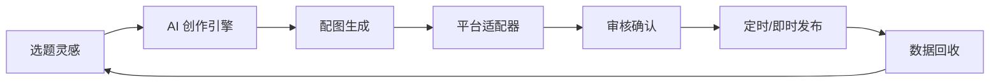
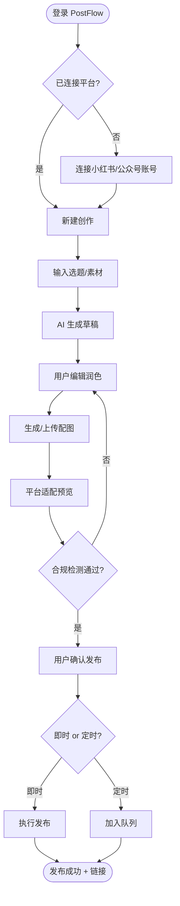
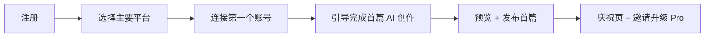

# 创流 PostFlow — 产品需求文档

> ⚠️ 本文含 **12 项待验证假设**，标注于 §10。商业数据为区间估算，非已验证财务结果。

| 字段 | 内容 |
|------|------|
| 版本 | v1.0 |
| 日期 | 2026-07-04 |
| 状态 | 草稿 |
| 作者 | Product Team |
| 密级 | 对外展示 |

---

## 0. 文档导读

| 读者 | 建议阅读章节 |
|------|-------------|
| 投资人 / 合作方 | §1 Executive Summary、§2 商业模式、§2.5 竞争格局 |
| 产品 / 运营 | 全文，重点 §3–§7 |
| 研发 | §4 产品方案、§5 功能需求、§8 技术要点、§9 里程碑 |

---

## 1. Executive Summary（商业计划书摘要）

### 1.1 一句话定位

**AI 驱动的社媒图文创作与一键分发工作台**

### 1.2 Elevator Pitch

创流 PostFlow 面向独立自媒体、品牌运营和小型 MCN，提供「选题 → AI 辅助写稿 → 配图生成 → 多平台适配 → 定时发布 → 数据回收」闭环。用户在一个工作台完成原本分散在 ChatGPT、Canva、各平台后台的 5 个工具切换，将单篇图文产出时间从 2–4 小时压缩至 20–40 分钟。Freemium 订阅 + 按量 AI 额度变现，MVP 优先打通小红书与微信公众号。

### 1.3 关键数字一览

| 指标 | 当前/目标 | 备注 |
|------|-----------|------|
| 目标市场 (SAM) | ¥18–25 亿/年 | 中国社媒运营 SaaS + AI 写作工具交叉市场 |
| MVP 周期 | 8 周 | 2 平台发布 + 核心创作链路 |
| 预期 MVP 成本 | ¥35–50 万 | 5 人小团队 × 2 月 |
| 12 个月 ARR 目标 | ¥300–500 万 | 假设 M12 付费用户 3,000–5,000 |
| North Star 指标 | **周成功发布篇数**（Weekly Published Posts） | 衡量创作+发布闭环真实价值 |

### 1.4 为什么是现在

- **AI 写作质量跨过可用阈值**：大模型在短图文、标题、平台风格适配上已接近人工初稿水平，用户接受度显著提升。
- **多平台运营成为常态**：小红书、公众号、微博、知乎等平台规则差异大，「一稿多发」需求强烈但工具链割裂。
- **平台 API / 自动化生态成熟**：已有浏览器自动化、开放平台接口等可行路径，发布环节可从纯人工走向半自动/全自动。
- **创作者职业化**：全职/兼职自媒体人数持续增长，愿意为「省时间」付费的工具 ARPU 高于普通 C 端。

### 1.5 核心亮点（3 条）

1. **创作 + 发布一体化**：竞品多只做写作（Jasper、秘塔）或只做排期（新榜、微盟），PostFlow 打通最后一环。
2. **平台原生适配引擎**：非简单复制粘贴，自动处理标题字数、标签、封面比例、排版规范等平台差异。
3. **可复用的风格记忆**：品牌调性、历史爆款结构、禁用词库持久化，越用越「像你自己写的」。

---

## 2. 商业模式说明（必填）

### 2.1 商业模式画布（精简版）

| 模块 | 内容 |
|------|------|
| **客户细分** | ① 独立自媒体（1–3 万粉）② 品牌社媒运营（1–3 人团队）③ 小型 MCN / 代运营（5–20 账号） |
| **价值主张** | 将图文创作+多平台发布效率提升 3–5 倍，降低跨平台格式适配成本 |
| **渠道** | 创作者社区（即刻、小红书、知识星球）、SEO、KOL 联名、代运营 agency 转介绍 |
| **客户关系** | 自助 SaaS + 模板市场 + Pro 用户专属社群 |
| **收入来源** | 订阅制 + AI 额度加购 + 企业版 seat 授权 |
| **核心资源** | 平台发布连接器、Prompt/风格模板库、用户内容资产数据 |
| **关键业务** | AI 创作引擎迭代、平台适配规则维护、发布成功率保障 |
| **重要合作** | LLM 供应商、各社媒开放平台、图片生成 API、支付/云服务 |
| **成本结构** | AI API（变动）、云基础设施、研发人力、获客、合规 |

### 2.2 收入模式详解

**模式类型**：订阅制 + 按量计费（混合）

| 套餐 | 价格 | 目标客户 | 包含能力 | 战略意图 |
|------|------|----------|----------|----------|
| **Free** | ¥0 | 试用者 | 5 篇/月 AI 创作、1 个平台连接、无定时发布 | 获客、体验闭环 |
| **Creator** | ¥79/月 或 ¥699/年 | 独立自媒体 | 50 篇/月、3 平台、定时发布、基础数据看板 | 核心利润层 |
| **Pro** | ¥199/月 或 ¥1,699/年 | 品牌运营 | 200 篇/月、全平台、品牌风格库、协作 3 seat | 高 ARPU |
| **Team** | ¥499/月起 | MCN/代运营 | 无限平台账号、审批流、API、专属客服 | 大单 |

**AI 加购**：超出套餐额度 ¥1.5/篇（含文字+1 张配图）

**定价锚点**：
- 秘塔写作猫 Pro ≈ ¥96/年（仅写作，无发布）
- 新榜有赚 / 微盟社媒工具 ≈ ¥200–500/月（偏数据与排期）
- Canva Pro ≈ $120/年（设计，无 AI 写作深度）

**价值定价依据**：节省运营 1 人 × 50% 工时 ≈ ¥4,000–8,000/月人力成本，¥199/月定价约为节省价值的 2–5%。

### 2.3 单位经济模型

| 指标 | 预估值 | 假设 |
|------|--------|------|
| ARPU | ¥95/月 | Creator:Pro = 7:3 加权 |
| 毛利率 | 68–75% | AI API 占收入 15–22% |
| CAC | ¥180–280 | 社区+SEO 为主 |
| 月留存率 | 85%（M6 后） | 发布习惯形成后切换成本高 |
| 平均留存 | 10 个月 | |
| LTV | ¥95 × 72% × 10 ≈ ¥684 | |
| LTV/CAC | 2.4–3.8 | M12 目标 ≥ 3 |
| 回本周期 | 8–11 个月 | |

### 2.4 市场规模（TAM / SAM / SOM）

| 层级 | 定义 | 规模 | 估算逻辑 |
|------|------|------|----------|
| **TAM** | 中国内容营销 + 社媒工具市场 | ~¥800 亿/年 | 艾瑞 2025 内容营销规模 |
| **SAM** | 有付费意愿的图文自媒体 + 品牌社媒 SaaS | ¥18–25 亿/年 | 活跃创作者 500 万 × 5% 付费 × ¥700 年均 |
| **SOM（3 年）** | PostFlow 可触达份额 | ¥3,000 万–1 亿/年 | 3 万付费用户 × ¥1,000 年均 |

### 2.5 竞争格局与壁垒

| 竞品 | 强项 | 弱项 | PostFlow 差异 |
|------|------|------|---------------|
| 秘塔写作猫 / WPS AI | 写作质量、低价 | 无发布、无平台适配 | 创作→发布闭环 |
| Canva / 稿定设计 | 设计模板 | 写作弱、无中台分发 | AI 图文一体 |
| 新榜 / 飞瓜 | 数据分析 | 非创作工具 | 上游创作截流 |
| ChatGPT + 手动发布 | 灵活 | 工具链割裂、无记忆 | 工作流产品化 |
| 各平台自带 AI | 免费、原生 | 单平台、不可跨平台 | 跨平台中台 |

**竞争壁垒评估**：

| 壁垒类型 | 强度 (1–5) | 说明 |
|----------|------------|------|
| 切换成本 | 4 | 风格库、发布历史、定时任务迁移成本高 |
| 数据壁垒 | 3 | 爆款结构、平台规则库随用户积累增强 |
| 网络效应 | 2 | 模板市场有弱网络效应 |
| 品牌 | 2 | 早期弱，需案例积累 |
| 技术 | 3 | 发布连接器 + 平台规则引擎需持续维护 |

**诚实弱点**：大厂（字节、腾讯）可能内置类似能力；平台反自动化政策是结构性风险。

### 2.6 风险与对策

| 风险类型 | 描述 | 概率 | 影响 | 对策 |
|----------|------|------|------|------|
| **市场** | 创作者付费意愿低于预期 | 中 | 高 | Freemium 降门槛；ROI 计算器展示省时价值 |
| **竞争** | 平台自带 AI 写作+发布 | 高 | 中 | 聚焦跨平台中台；做平台做不到的「统一工作台」 |
| **技术** | 平台改版导致发布失败 | 高 | 高 | 官方 API 优先；自动化作 fallback；发布前预览+人工确认 |
| **合规** | 自动化发布违反平台 ToS / 封号 | 中 | 高 | 用户授权+风险提示；频率限制；官方 API 合规路径 |
| **内容** | AI 生成违规/低质内容 | 中 | 中 | 敏感词过滤、原创度检测、发布前人工确认默认开启 |

### 2.7 融资 / 资源需求（如适用）

| 用途 | 金额 | 里程碑 |
|------|------|--------|
| MVP 研发（8 周） | ¥40 万 | 2 平台发布跑通，100 内测用户 |
| 增长（M3–M6） | ¥60 万 | 1,000 注册用户，100 付费 |
| 平台连接器扩展 | ¥30 万 | 4 平台全覆盖 |
| **合计 Seed** | **¥130 万** | M12 ARR ¥300 万+ |

---

## 3. 问题定义与用户

### 3.1 问题陈述

**现状**：社媒创作者每天需要在选题、写稿、配图、改格式、登录多个平台后台发布之间反复切换，平均单篇图文耗时 2–4 小时。

**痛点**：
- AI 写作工具只产出文字，发布仍需手动复制、改标题、调封面
- 各平台规则不同（小红书 20 字标题、公众号 HTML 排版、微博 140 字限制）
- 定时发布依赖多个工具，数据分散无法复盘
- 品牌调性难以在多次 AI 生成中保持一致

**后果**：产能瓶颈限制账号增长；运营 burnout；多平台布局名存实亡（只维护 1–2 个主平台）。

### 3.2 目标用户画像

#### Primary Persona：小林 — 独立小红书博主

| 属性 | 描述 |
|------|------|
| 角色 | 全职生活方式博主，小红书 2 万粉，同步运营公众号 |
| 年龄 | 26–32 |
| 目标 | 日更或隔日更，涨粉至 5 万，接品牌合作 |
| 痛点 | 写笔记 1h + Canva 配图 40min + 双平台发布 30min；选题枯竭 |
| 现有方案 | ChatGPT + Canva + 手动发布；试过秘塔但还要自己发 |
| 付费意愿 | 中高，¥50–150/月可接受，若明显省时 |

#### Secondary Persona：Amy — 品牌社媒运营

| 属性 | 描述 |
|------|------|
| 角色 | DTC 品牌市场专员，负责小红书+公众号+微博 |
| 痛点 | 老板要数据；同事协作改稿；品牌调性统一 |
| 付费意愿 | 高，走公司预算，¥200–500/月 |

#### Anti-Persona（暂不服务）

| 客群 | 原因 |
|------|------|
| 短视频 / 直播为主创作者 | 产品不做视频剪辑与发布 |
| 纯 SEO 长文站点运营 | 非社媒场景，需求不同 |
| 百万粉 MCN 矩阵 | MVP 阶段无多账号矩阵与审批流 |

### 3.3 用户场景 & User Stories

| ID | User Story | 优先级 |
|----|------------|--------|
| US-01 | As a 博主，I want 输入一个选题让 AI 生成小红书风格图文草稿，so that 我 10 分钟内拿到可发初稿 | P0 |
| US-02 | As a 博主，I want 一键将同一内容适配为公众号格式并定时发布，so that 我不必手动改两遍 | P0 |
| US-03 | As a 运营，I want 连接我的平台账号并自动发布，so that 我不用每天登录多个后台 | P0 |
| US-04 | As a 博主，I want AI 根据我的历史爆款生成相似结构的新稿，so that 保持风格一致性 | P1 |
| US-05 | As a 运营，I want 查看各平台发布状态与基础阅读数据，so that 我知道哪篇需要优化 | P1 |
| US-06 | As a 团队，I want 稿件审批后再发布，so that 品牌内容可控 | P2 |

---

## 4. 产品方案

### 4.1 产品定位

**创流 PostFlow** = 社媒图文领域的「创作 IDE + 发布 CI/CD」—— 在统一工作台完成 AI 辅助创作、平台适配与自动分发，** deliberately 不做短视频**。

### 4.2 核心价值闭环



### 4.3 信息架构 / 核心模块

| 模块 | 说明 | MVP |
|------|------|-----|
| 工作台 Dashboard | 待发布、定时队列、最近数据 | ✅ |
| 创作 Studio | AI 写稿、改写、标题生成 | ✅ |
| 配图 Lab | AI 封面/插图生成、裁剪适配 | ✅ |
| 平台适配器 | 各平台格式转换预览 | ✅ |
| 发布中心 | 账号连接、定时、发布日志 | ✅ |
| 风格记忆库 | 品牌调性、禁用词、结构模板 | ❌ V1 |
| 数据看板 | 跨平台阅读/互动汇总 | ❌ V1 |
| 协作审批 | 团队审稿流 | ❌ V1 |

---

## 5. 功能需求

### 5.1 功能总览

| ID | 功能 | 描述 | 优先级 | MVP |
|----|------|------|--------|-----|
| F-01 | AI 图文创作 | 选题→大纲→正文→标题→标签 | P0 | ✅ |
| F-02 | 平台风格适配 | 一键生成小红书/公众号/微博版本 | P0 | ✅ |
| F-03 | AI 配图生成 | 封面+正文插图，自动裁切比例 | P0 | ✅ |
| F-04 | 平台账号连接 | OAuth / Cookie 授权管理 | P0 | ✅ |
| F-05 | 即时发布 | 确认后一键发布到选定平台 | P0 | ✅ |
| F-06 | 定时发布 | 队列调度、时区、失败重试 | P0 | ✅ |
| F-07 | 发布预览 | 各平台真实渲染预览 | P0 | ✅ |
| F-08 | 草稿箱 | 保存、版本对比、恢复 | P1 | ✅ |
| F-09 | 风格记忆库 | 品牌人设、历史范文学习 | P1 | ❌ |
| F-10 | 数据看板 | 发布后基础指标回收 | P1 | ❌ |
| F-11 | 敏感词/合规检测 | 发布前风险提示 | P1 | ✅ |
| F-12 | 协作审批 | 多人审稿、评论、批准发布 | P2 | ❌ |
| F-13 | 模板市场 | 行业爆款结构模板 | P2 | ❌ |
| F-14 | 开放 API | 第三方集成 | P2 | ❌ |

### 5.2 功能详述（P0）

#### F-01：AI 图文创作

- **描述**：用户输入选题/关键词/参考链接，AI 生成完整图文草稿（标题、正文、建议标签、配图描述）。
- **用户流程**：新建创作 → 选平台类型 → 输入选题 → AI 生成 → 用户编辑 → 进入适配/发布。
- **验收标准**：
  - [ ] Given 用户输入 ≥10 字选题，When 点击生成，Then 30 秒内返回含标题+正文+≥3 标签的草稿
  - [ ] Given 用户选择「小红书」风格，When 生成完成，Then 正文含 emoji 分段、口语化表达，标题 ≤20 字
  - [ ] Given 用户选择「公众号」风格，When 生成完成，Then 正文结构含小标题、段落清晰，字数 800–2000 可配置
  - [ ] 支持「重写」「缩短」「扩写」「换标题」4 种快捷操作
- **成功指标**：生成采纳率（用户未清空即进入下一步）≥ 60%
- **依赖**：LLM API（GPT-4o / DeepSeek / Claude 可配置）

#### F-02：平台风格适配

- **描述**：同一源稿件自动转换为多平台版本，处理字数、格式、标签差异。
- **验收标准**：
  - [ ] Given 一篇源稿，When 选择目标平台小红书+公众号，Then 生成 2 份独立版本并展示 diff 高亮
  - [ ] 小红书版：标题 ≤20 字、正文 ≤1000 字建议、自动提取话题标签
  - [ ] 公众号版：支持 Markdown→富文本、引导关注语可选插入
  - [ ] 微博版：正文 ≤140 字（或长微博策略说明）
- **成功指标**：用户手动修改率 < 30%（修改字符数/总字符数）

#### F-03：AI 配图生成

- **描述**：根据正文生成封面图 + 可选正文插图，自动适配平台比例。
- **验收标准**：
  - [ ] Given 已完成文稿，When 点击「生成配图」，Then 60 秒内返回 ≥1 张封面候选
  - [ ] 小红书封面比例 3:4；公众号封面 2.35:1；支持手动上传替换
  - [ ] 图片可重新生成、微调 prompt
- **成功指标**：配图直接使用率 ≥ 50%

#### F-04：平台账号连接

- **描述**：安全连接用户社媒账号，支持多账号管理。
- **MVP 支持平台**：
  - P0：小红书、微信公众号
  - V1：微博、知乎
- **验收标准**：
  - [ ] 用户可添加/删除/重新授权账号
  - [ ] Token 加密存储，前端不可见
  - [ ] 授权失效时 Dashboard 告警 + 一键重新登录
  - [ ] 发布前展示将使用的账号昵称/头像确认
- **依赖**：平台 OAuth（可用时）或受控浏览器会话（fallback，需用户明确授权与风险提示）

#### F-05：即时发布

- **描述**：用户确认内容后，一键发布到已连接平台。
- **验收标准**：
  - [ ] Given 内容+配图+账号已就绪，When 点击发布，Then 120 秒内完成并返回平台链接
  - [ ] 发布失败时返回明确错误码（授权失效/内容违规/平台限流/网络错误）
  - [ ] 默认开启「发布前确认」弹窗，展示最终预览
  - [ ] 发布日志可查看：时间、平台、状态、链接
- **成功指标**：发布成功率 ≥ 95%（排除用户主动取消）

#### F-06：定时发布

- **描述**：将内容加入发布队列，按指定时间自动发布。
- **验收标准**：
  - [ ] 支持设置日期+时间（精确到分钟）
  - [ ] 队列列表可编辑、取消、提前发布
  - [ ] 失败自动重试 3 次（间隔 5/15/30 分钟），仍失败则通知用户
  - [ ] 同一账号同一平台最小发布间隔可配置（默认 ≥4 小时，防风控）
- **成功指标**：定时准时率 ≥ 99%

#### F-07：发布预览

- **描述**：模拟各平台真实展示效果。
- **验收标准**：
  - [ ] 小红书：笔记卡片预览（封面+标题+前 3 行正文）
  - [ ] 公众号：图文消息列表预览
  - [ ] 预览与发布后视觉差异 < 可接受阈值（人工评审）

#### F-11：敏感词/合规检测

- **描述**：发布前扫描违禁词、广告法风险、平台规则冲突。
- **验收标准**：
  - [ ] 命中敏感词高亮并阻断发布（可强制 override 需二次确认）
  - [ ] 内置平台规则提示（如小红书导流外链限制）

### 5.3 非功能需求

| 类别 | 要求 |
|------|------|
| **性能** | AI 生成 P95 < 30s；发布 P95 < 120s；页面加载 < 2s |
| **安全** | 账号 Token AES-256 加密；HTTPS 全站；SOC2 方向设计 |
| **合规** | 用户内容归属用户；隐私政策；发布前人工确认默认开启；遵守各平台 ToS |
| **可用性** | 核心流程 ≤5 步完成首次发布；新用户引导 ≤10 分钟 |
| **可靠性** | 服务可用性 99.5%；发布任务不丢失（持久化队列） |

### 5.4 明确不做（Out of Scope）

- ❌ **短视频**：不做视频脚本、剪辑、视频发布（抖音、视频号、B 站）
- ❌ **直播**：不做直播推流、直播复盘
- ❌ **评论区 AI 自动回复**（V1 不做，避免骚扰与封号风险）
- ❌ **买粉/刷量**
- ❌ **爬虫采集竞品私密数据**
- ❌ **移动端原生 App**（MVP 仅 Web 响应式）

---

## 6. 用户流程

### 6.1 核心流程：从选题到发布



### 6.2 首次用户 Onboarding



---

## 7. 成功指标

### 7.1 North Star Metric

**周成功发布篇数（Weekly Published Posts）**

定义：所有活跃用户在一周内通过 PostFlow **成功发布**到至少 1 个平台的图文篇数总和。

选择理由：同时衡量创作价值（有内容可发）和发布价值（真正闭环），比单纯注册数或 AI 调用数更能反映 PMF。

### 7.2 阶段性 KPI

| 阶段 | 指标 | 目标 | 测量方式 |
|------|------|------|----------|
| MVP 内测（W8） | 内测用户完成首篇发布率 | ≥ 70% | 漏斗分析 |
| MVP 内测 | 发布成功率 | ≥ 95% | 发布日志 |
| 公测 M1 | WAU | 500 | 埋点 |
| 公测 M3 | 付费转化率 | ≥ 5% | 订阅数据 |
| V1 M6 | 周成功发布篇数 | 2,000/周 | North Star |
| V1 M12 | MRR | ¥25–40 万 | 财务 |

### 7.3 商业模式验证指标

| 假设 | 验证指标 | 通过标准 |
|------|----------|----------|
| 用户愿为「发布闭环」付费 | Free→Creator 转化 | ≥ 5% @ M3 |
| AI 质量足够减少编辑时间 | 首稿→发布耗时 | 中位数 ≤ 40 分钟 |
| 多平台适配有真实需求 | 多平台发布占比 | ≥ 40% 用户发 ≥2 平台 |

---

## 8. 技术方案要点

### 8.1 架构概览

```
┌─────────────┐     ┌──────────────┐     ┌─────────────────┐
│  Web App    │────▶│  API Gateway │────▶│  Creation Svc   │
│  (Next.js)  │     │              │     │  (LLM + Prompt) │
└─────────────┘     └──────┬───────┘     └─────────────────┘
                           │
              ┌────────────┼────────────┐
              ▼            ▼            ▼
        ┌──────────┐ ┌──────────┐ ┌──────────────┐
        │ Image Svc│ │ Adapter  │ │ Publish Svc  │
        │ (Gen API)│ │ Engine   │ │ (Connectors) │
        └──────────┘ └──────────┘ └──────┬───────┘
                                         │
                           ┌─────────────┼─────────────┐
                           ▼             ▼             ▼
                        小红书        微信公众号      微博…
```

### 8.2 核心实体/数据模型

| 实体 | 关键字段 |
|------|----------|
| User | id, plan, ai_quota, created_at |
| PlatformAccount | user_id, platform, auth_token(enc), status, nickname |
| ContentDraft | user_id, source_text, versions[], status, style_profile_id |
| PlatformVariant | draft_id, platform, title, body, tags[], cover_image |
| PublishJob | variant_id, account_id, scheduled_at, status, platform_url, error |
| StyleProfile | user_id, tone, forbidden_words[], example_posts[] |

### 8.3 发布连接器策略

| 平台 | MVP 方案 | 优先级 | 风险 |
|------|----------|--------|------|
| 微信公众号 | 官方 API（素材+群发/发布） | P0 | 低，需认证服务号 |
| 小红书 | 创作者中心 API（如有）/ 受控浏览器自动化 | P0 | 中高，需 fallback 策略 |
| 微博 | 官方开放平台 API | V1 | 中 |
| 知乎 | 官方 API / 自动化 | V1 | 中 |

**原则**：官方 API 优先；自动化方案需用户显式授权 + 频率限制 + 发布前确认 + 风险提示。

### 8.4 第三方依赖

- LLM：OpenAI / DeepSeek / Claude（可切换）
- 图片生成：DALL·E / Flux / 即梦 API
- 基础设施：Vercel + Supabase / AWS
- 队列：Redis + BullMQ（定时发布）
- 支付：Stripe / 微信支付

### 8.5 技术风险

| 风险 | 缓解 |
|------|------|
| 平台 API 变更 | 连接器抽象层 + 版本化适配器 |
| 浏览器自动化不稳定 | 官方 API 迁移路线图；健康检查探针 |
| AI 成本过高 | 模型路由（简单任务用小模型）；缓存相似选题 |

---

## 9. 里程碑与资源

### 9.1 里程碑

| 阶段 | 时间 | 交付物 |
|------|------|--------|
| **M0 需求冻结** | W1 | PRD 评审通过、设计稿核心流程 |
| **M1 创作链路** | W2–3 | AI 写稿 + 配图 + 草稿箱 |
| **M2 适配+预览** | W4 | 小红书/公众号适配器 + 预览 |
| **M3 发布连接器** | W5–6 | 两平台账号连接 + 即时/定时发布 |
| **M4 内测** | W7 | 50 内测用户、发布成功率达标 |
| **M5 公测** | W8 | 付费订阅上线、Landing Page |
| **V1** | M3–M6 | 微博/知乎、风格库、数据看板、协作 |

### 9.2 团队配置建议（MVP）

| 角色 | 人数 | 职责 |
|------|------|------|
| 产品 | 1 | 需求、平台规则、用户访谈 |
| 全栈 | 2 | Web + API + 发布连接器 |
| AI/Prompt | 1 | 创作引擎、风格模板 |
| 设计 | 0.5 | UI/UX、预览组件 |

---

## 10. 假设与待验证项

| ID | 假设 | 验证方式 | 优先级 | 状态 |
|----|------|----------|--------|------|
| A-01 | 独立博主愿为「发布闭环」付 ¥79/月 | 5 人付费意愿访谈 + 预购页 | P0 | 待验证 |
| A-02 | AI 初稿采纳率可达 60%+ | MVP 埋点 | P0 | 待验证 |
| A-03 | 小红书自动化发布成功率 ≥95% | 内测 200 次发布 | P0 | 待验证 |
| A-04 | 多平台适配比「复制粘贴」省 ≥50% 时间 | 用户计时对比实验 | P0 | 待验证 |
| A-05 | CAC 可通过社区控制在 ¥280 以内 | M3 渠道测试 | P1 | 待验证 |
| A-06 | 公众号 API 路径可满足 80% 目标用户 | 用户账号类型调研 | P1 | 待验证 |
| A-07 | 月留存可达 85% | M6  cohort 分析 | P1 | 待验证 |
| A-08 | 品牌运营是第二增长曲线 | 10 家 SMB 销售拜访 | P1 | 待验证 |
| A-09 | AI API 成本 ≤22% 收入 | 财务模型实测 | P1 | 待验证 |
| A-10 | 用户接受「发布前人工确认」不会嫌烦 | 内测 NPS + 流程 abandonment | P1 | 待验证 |
| A-11 | 模板市场有供给方意愿 | 10 个创作者共建模板 | P2 | 待验证 |
| A-12 | 不做短视频不会显著限制 TAM | 用户平台分布问卷 | P2 | 待验证 |

---

## 11. 附录

### 11.1 竞品功能对比矩阵

| 能力 | PostFlow | 秘塔 | Canva | ChatGPT | 新榜 |
|------|----------|------|-------|---------|------|
| AI 写稿 | ✅ | ✅ | △ | ✅ | ❌ |
| AI 配图 | ✅ | ❌ | ✅ | △ | ❌ |
| 平台风格适配 | ✅ | △ | ❌ | ❌ | ❌ |
| 自动发布 | ✅ | ❌ | ❌ | ❌ | △ |
| 定时队列 | ✅ | ❌ | ❌ | ❌ | ✅ |
| 跨平台数据 | V1 | ❌ | ❌ | ❌ | ✅ |
| 短视频 | ❌ | ❌ | ✅ | ❌ | ✅ |

### 11.2 MVP 平台发布规格摘要

| 平台 | 标题限制 | 正文限制 | 图片 | 特殊规则 |
|------|----------|----------|------|----------|
| 小红书 | ≤20 字 | 建议 ≤1000 字 | 1–9 张，3:4 封面 | 话题 # 标签；外链限制 |
| 微信公众号 | ≤64 字 | 无硬限 | 封面 2.35:1 | 需认证服务号；原创声明 |
| 微博 | — | 140 字（短） | 1–9 张 | V1 支持 |

### 11.3 用户访谈提纲（5 题）

1. 你目前发一篇小红书图文全流程耗时？最烦哪一步？
2. 用过哪些 AI 写作工具？为什么不继续用？
3. 如果 AI 能直接帮你发到平台，你会担心什么？
4. ¥79/月买「创作+双平台发布」，你会考虑吗？
5. 除了小红书/公众号，还必须支持哪个平台？

### 11.4 修订记录

| 版本 | 日期 | 变更 |
|------|------|------|
| v1.0 | 2026-07-04 | 初稿：基于模糊 IDEA 完整推断 |
