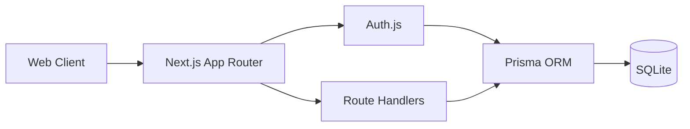

# PostFlow 全栈 MVP 开发方案以及方案对比

| 字段 | 内容 |
|------|------|
| 版本 | v1.0 |
| 日期 | 2026-07-05 |
| 适用范围 | `post-flow`（当前单仓 Next.js 项目） |
| 核心目标 | 在最短周期内完成“可真实登录注册”的全栈 MVP |

---

## 1. 背景与目标

当前 `post-flow` 已具备高保真前端 Demo 与 Mock 流程，但鉴权仍为本地模拟。  
现阶段目标是**快速落地 MVP**，优先完成：

1. 真实用户注册与登录（邮箱+密码）
2. 登录态持久化与路由鉴权
3. 用户数据隔离（每个用户只看自己的草稿/队列/日志）
4. 使用轻量数据库（SQLite）快速上线验证

---

## 2. 技术方案对比

### 2.1 方案定义

- **方案1（推荐）**：单仓全栈，全部在 `post-flow` 内实现  
  - Next.js App Router + TypeScript
  - Route Handlers 做后端 API
  - SQLite 做数据存储
- **方案2**：前后端拆分，新增 Python 后端项目  
  - 前端：`post-flow`
  - 后端：FastAPI/Django + SQLite/Postgres

### 2.2 对比结论

| 维度 | 方案1：单仓 Node.js/TS | 方案2：新增 Python 后端 |
|------|------------------------|--------------------------|
| 开发速度 | **最快**（一个工程、一个运行环境） | 慢（跨仓通信、联调成本高） |
| 学习/维护成本 | **低**（语言统一） | 高（双技术栈） |
| 部署复杂度 | **低**（单服务） | 高（前后端分离部署） |
| MVP 适配性 | **高** | 中 |
| 中长期扩展 | 中（可后续再拆） | 高（天然分层） |
| 当前阶段推荐 | **是** | 否 |

> 结论：现阶段应采用**方案1**，以交付速度为第一优先级。

---

## 3. 最终选型（方案1）

### 3.1 技术栈

- 框架：Next.js 15 + TypeScript（保持现状）
- 数据库：SQLite
- ORM：Prisma
- 鉴权：Auth.js（NextAuth）Credentials Provider
- 密码哈希：`bcryptjs`
- 会话策略：JWT（MVP 快速）  
  > 后续可切换 DB Session，不影响 API 形态

### 3.2 为什么这套最适合 MVP

1. 对现有项目改动最小，不需要新仓库
2. 路由、API、页面都在一个工程里，开发效率最高
3. SQLite 无外部依赖，开箱即用，便于本地与早期部署

---

## 4. 目标架构（MVP）

---

## 5. 数据模型设计（最小可用）

> 先满足登录注册 + 用户数据隔离；业务表逐步替换现有 localStorage Mock。

### 5.1 核心表

1. `User`
   - `id` (cuid)
   - `email` (unique)
   - `passwordHash`
   - `name`（可空）
   - `plan`（free/creator/pro/team）
   - `aiQuotaUsed`
   - `aiQuotaLimit`
   - `createdAt` / `updatedAt`

2. `Draft`（最小字段）
   - `id`
   - `userId`（外键）
   - `topic`
   - `masterTitle`
   - `masterBody`
   - `status`
   - `createdAt` / `updatedAt`

3. `PublishJob`（最小字段）
   - `id`
   - `userId`
   - `draftId`
   - `platform`
   - `mode`
   - `status`
   - `scheduledAt`（可空）
   - `createdAt` / `updatedAt`

---

## 6. 登录注册功能落地方案

### 6.1 页面改造

- `src/app/(auth)/register/page.tsx`
  - 从“Mock 一键注册”改为真实提交
  - 调用 `POST /api/auth/register`
  - 注册成功后自动 `signIn` 并跳转 `/dashboard`

- `src/app/(auth)/login/page.tsx`
  - 调用 `signIn('credentials')`
  - 成功跳转 `/dashboard`
  - 失败显示错误信息（邮箱不存在/密码错误）

### 6.2 API 设计

1. `POST /api/auth/register`
   - 入参：`email`, `password`, `name?`
   - 校验：
     - 邮箱格式
     - 密码强度（至少 8 位）
     - 邮箱唯一性
   - 出参：`201 { ok: true }` 或 `4xx`

2. Auth.js 内置登录流程
   - `CredentialsProvider.authorize()`
   - 校验邮箱 + 哈希密码
   - 返回用户对象（写入 JWT）

### 6.3 鉴权与路由保护

- 在 `(app)` 分组页面增加服务端会话检查（`auth()`）
- 未登录时统一重定向 `/login`
- 已登录用户访问 `/login`、`/register` 自动跳转 `/dashboard`

---

## 7. 开发阶段计划（7 天 MVP）

### Day 1-2：基础设施

1. 安装依赖：`prisma`、`@prisma/client`、`next-auth`、`bcryptjs`
2. 初始化 Prisma + SQLite
3. 建立 `User` 表并完成 migration
4. 接入 Auth.js 基础配置

### Day 3：注册登录闭环

1. 实现 `POST /api/auth/register`
2. 改造登录/注册页面为真实调用
3. 完成错误提示与跳转逻辑

### Day 4-5：数据隔离与页面接入

1. 将 Dashboard/Drafts/Queue/Logs 改为“按当前用户读取”
2. 保留 Mock 作为降级兜底（开发开关）
3. 清理 `DemoStore` 在鉴权链路中的关键依赖

### Day 6：联调与修复

1. 登录态刷新后保持
2. 鉴权重定向边界（未登录/已登录）
3. 表单异常场景回归（重复注册、密码错误）

### Day 7：验收与文档

1. 补充 `.env.example`
2. 更新 README 启动步骤
3. 完成验收清单

---

## 8. 验收标准（登录注册）

1. 新用户可注册，重复邮箱会被阻止
2. 已注册用户可登录，错误密码有提示
3. 登录后刷新页面不掉线
4. 未登录访问 `/dashboard` 自动跳转 `/login`
5. 用户 A 无法读取用户 B 数据

---

## 9. 方案2（Python 后端）保留路径

当满足以下条件时再考虑迁移到方案2：

1. 业务复杂度显著增加（任务调度、爬虫、复杂队列）
2. 需要独立扩容后端服务
3. 团队已有 Python 后端研发资源

迁移建议：
- 先保持前端 API 契约不变
- 再将 Route Handlers 内部实现替换为 Python 服务调用
- 最后逐步下沉发布/调度等模块

---

## 10. 风险与应对

| 风险 | 影响 | 应对 |
|------|------|------|
| SQLite 并发能力有限 | 中 | MVP 阶段可接受；后续迁移 Postgres |
| Auth 接入改动面较大 | 中 | 先只改登录注册与保护路由，业务 API 分批切换 |
| Mock 与真实数据并存导致逻辑混乱 | 高 | 增加 `DATA_SOURCE=mock|db` 开关，分层清晰 |

---

## 11. 最终建议

当前阶段直接执行**方案1（单仓 Next.js + TypeScript + SQLite）**，优先上线真实登录注册与用户数据隔离。  
这是“最短路径可用”的 MVP 技术方案，后续可无缝演进到独立后端架构。

